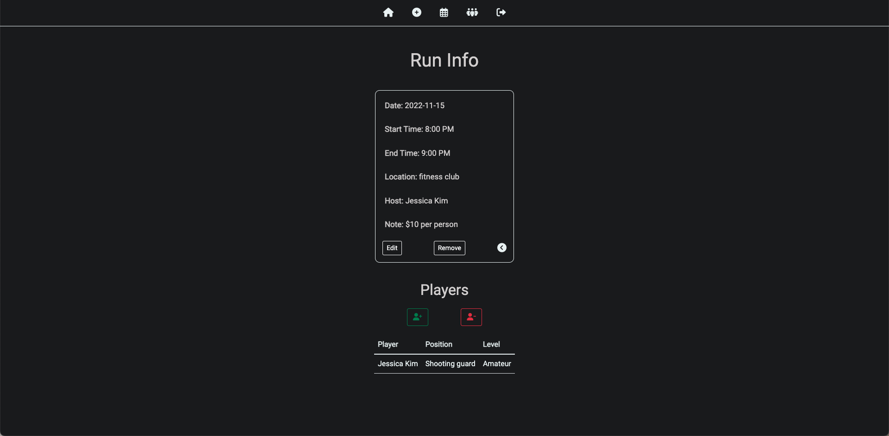
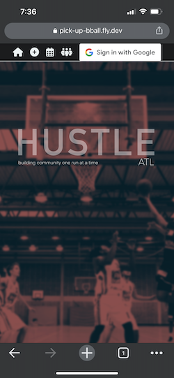
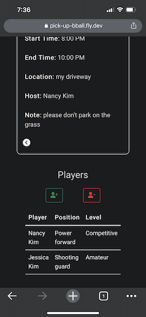
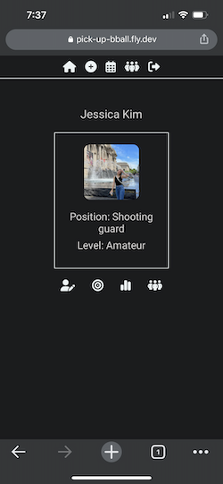
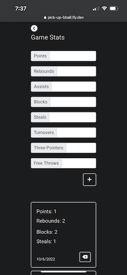

# pick-up-bball

## ☟ LINK BELOW ☟
## 🏀 [HUSTLE ATL](https://pick-up-bball.fly.dev/) 🏀

## Background & Description
🔥 Welcome to **HUSTLE ATL**! 🔥  
Where we build community one run at a time. 

The inspiration behind this app came from speaking with my friend, Andrew, who plays basketball competitively and frequently hosts pick-up runs in Atlanta. He shared with me his idea of creating an app that assists people with scheduling gym rentals and managing payments. With his permission and willingness to work with me, I decided to use this as an opportunity to take on my first client.

A few of the current problems Andrew and his friends were dealing with when scheduling runs include:
  - inconvenience of messaging people back and forth on whether they plan to attend
  - managing payments by sending out Venmo requests

Though this app does not solve all the issues at hand, I thoroughly enjoyed creating a project with the intention of helping others and hopefully making their lives just a little bit easier.

## Planning Materials
- [Trello Link](https://trello.com/b/4ZJCWAd6/pick-up-bball) 
  - Includes user stories, ice box items, and links to the Entity Relationship (ER) Diagram and wireframes

## Screenshots of the App 📸

 

## Technology Used
  - HTML
  - CSS
  - JavaScript
  - Express/Node
  - Mongoose/MongoDB
  - Google OAuth
  - GitHub
  - Visual Studio Code
  - Procreate

## Credits
- [Unsplash](https://unsplash.com/)
- [Favicon.io](https://favicon.io/)
- [Google Fonts](https://fonts.google.com/)
- [Bootstrap](https://getbootstrap.com/)
- [Font Awesome](https://fontawesome.com/)

## Icebox Items 🧊
  - [ ] Provide the option to turn on notifications and be alerted of an upcoming run that a user is signed up for
  - [ ] Provide a page with a list of all the upcoming runs a user is wanting to attend
  - [ ] Create admin authorization to limit who gets to schedule a run
  - [ ] Provide easy access for users to pay the host of a run directly through the app
  - [ ] Include a time input where users can schedule runs at any time throughout the day
  - [ ] List the scheduled runs in order from earlier to later dates